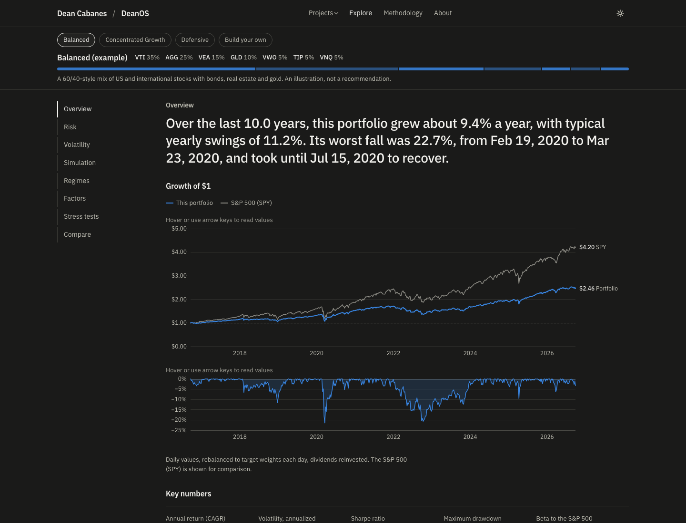
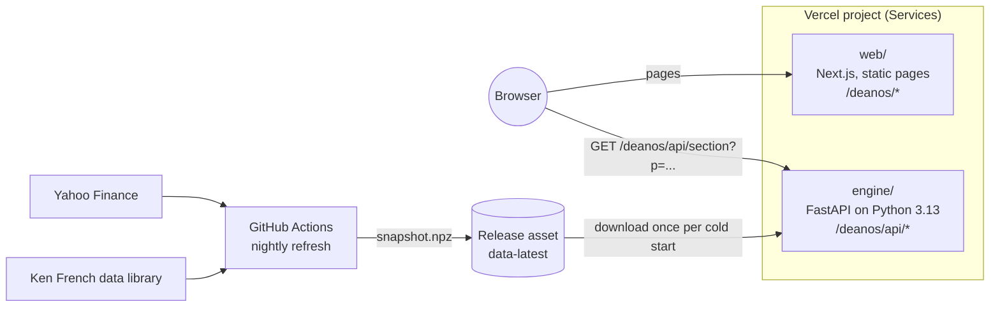
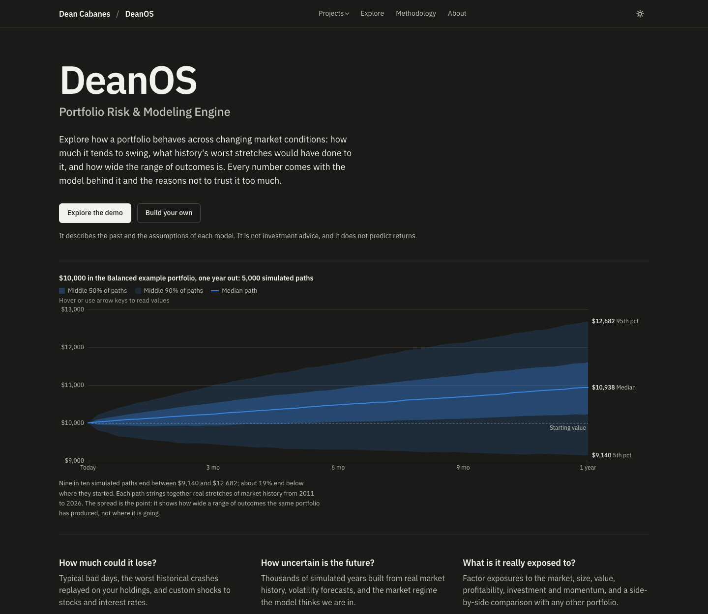
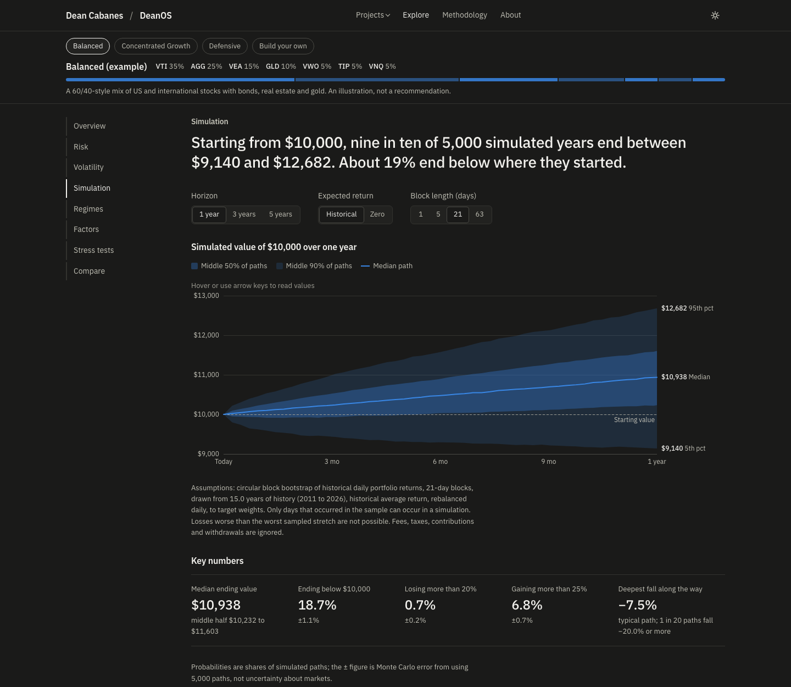
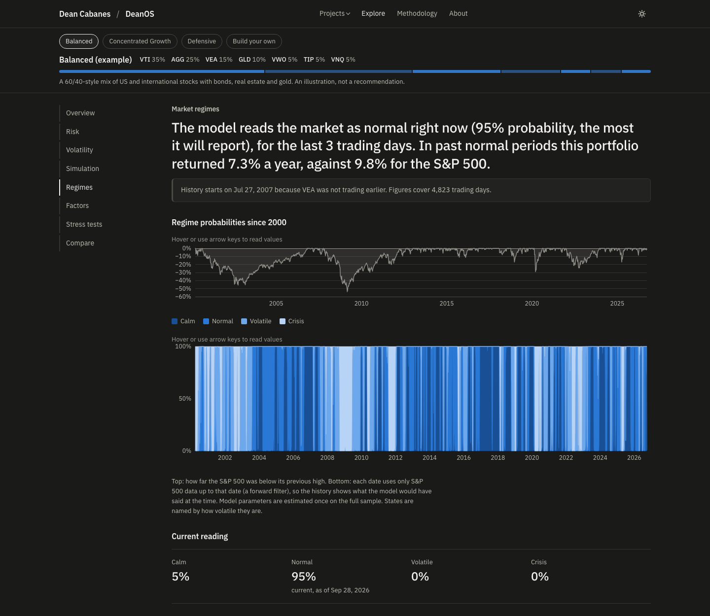
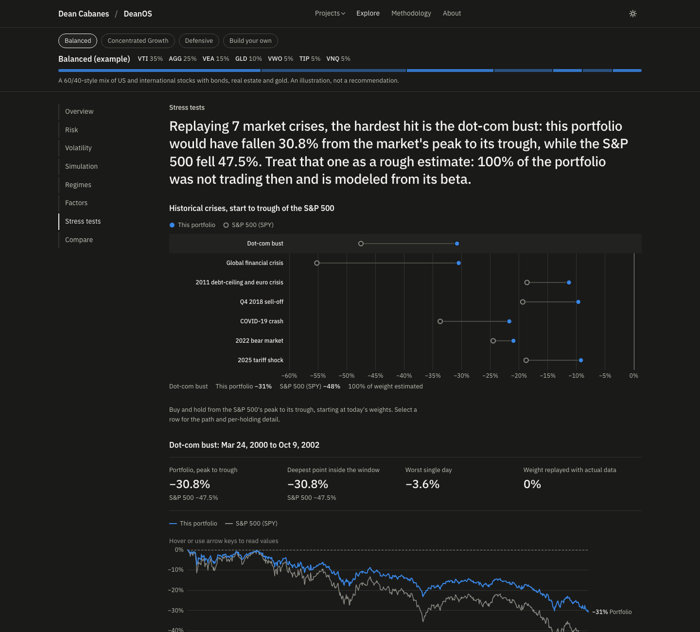
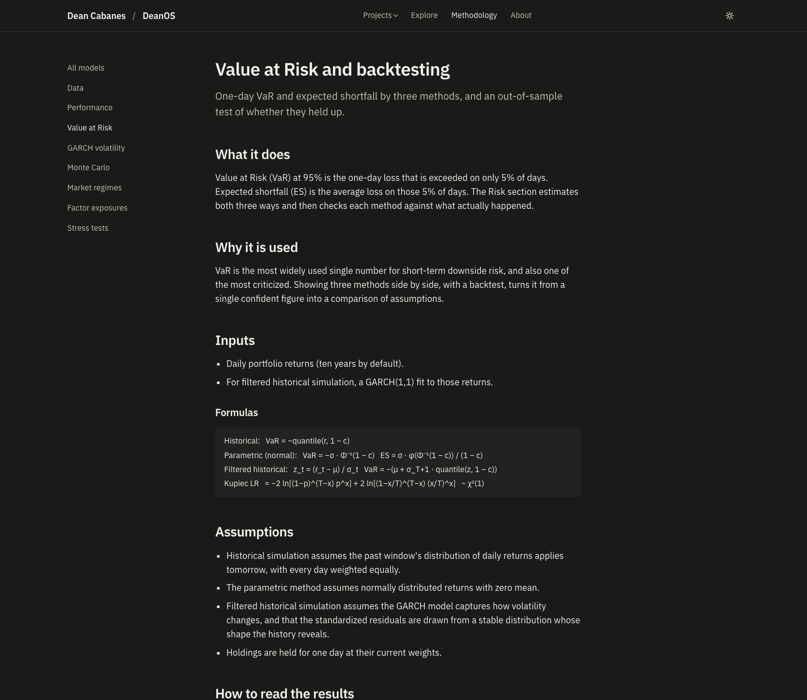
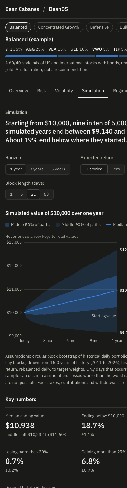

# DeanOS

**Portfolio risk and modeling engine.** Explore how a portfolio behaves across changing market conditions: how much it swings, what history's worst crises would have done to it, how wide the range of outcomes is, and what it is really exposed to. Every number comes with the model behind it and the reasons not to trust it too much.

Home: [deancabanes.com/deanos](https://deancabanes.com/deanos).



> **Disclaimer.** DeanOS is an educational and analytical project. It describes historical data under stated model assumptions. It is not investment advice, and none of its output is a prediction.

## Contents

- [What it is](#what-it-is)
- [Why I built it](#why-i-built-it)
- [Features](#features)
- [Architecture](#architecture)
- [Quantitative models](#quantitative-models)
- [Validation](#validation)
- [Limitations](#limitations)
- [Technology](#technology)
- [Local development](#local-development)
- [Deployment](#deployment)
- [Security and privacy](#security-and-privacy)
- [Screenshots](#screenshots)
- [How this was built](#how-this-was-built)

## What it is

A web application with a Python modeling engine. Pick one of three example portfolios or enter up to 25 tickers with weights, and DeanOS analyzes it eight ways. Each section opens with a plain-English answer, shows a chart that makes the uncertainty visible, gives key numbers as ranges, and links to a methodology page that explains the model, its assumptions and where it fails.

The site is built for three kinds of visitors: someone who wants the one-sentence answer, someone who wants to poke at the charts, and someone who wants to check the math.

## Why I built it

I'm an economics student interested in finance, quantitative modeling, data and AI. I wanted to understand the risk models I kept reading about: how GARCH decides volatility is rising, what a hidden Markov model means by a "regime", why Value at Risk is everywhere and constantly criticized. Building them, testing them against known results, and finding out where their assumptions break taught me more than reading about them.

DeanOS started as a personal tool. This is the public version: rebuilt, retested, and documented. It is not an institutional risk system, and I'm not presenting it as one.

## Features

| Section | Question it answers | Method |
|---|---|---|
| Overview | How has it done, and how much does that depend on luck? | CAGR, volatility, Sharpe, Sortino, drawdowns, betas, risk contributions, block-bootstrap ranges |
| Risk | How much could it lose on a bad day? Did those estimates hold up? | Historical, parametric and filtered historical VaR and expected shortfall; Kupiec and Christoffersen backtests |
| Volatility | How volatile is it now, and where is that heading? | GARCH(1,1) with EWMA fallback; horizon-average forecasts; Ljung-Box diagnostics |
| Simulation | What range of outcomes has this portfolio's history produced? | 5,000-path circular block bootstrap; historical or zero expected return |
| Regimes | What kind of market are we in, and how did the portfolio do in each? | Four-state Gaussian HMM on the S&P 500 with forward-filtered probabilities |
| Factors | What is it exposed to? | Fama-French five factors plus momentum, Newey-West errors, VIF |
| Stress tests | What would past crises have done to it? | Replay of seven crises with actual returns; linear market and rate shocks |
| Compare | How does it stack up against another portfolio, or an edited copy? | All of the above on common dates |

Portfolios live only in the page address (`/deanos/explore?p=VTI:60,AGG:40`). Nothing is stored and no cookies are set.

## Architecture



- **One repository, one Vercel project.** [Vercel Services](https://vercel.com/docs/services) builds `web/` (Next.js) and `engine/` (FastAPI) separately and routes `/deanos/api/*` to the engine and everything else to the web app ([`vercel.json`](vercel.json)).
- **No market calls on page requests.** A nightly GitHub Action downloads adjusted closes for the S&P 500 and about 45 ETFs back to 2000, plus the Fama-French factors; fits the market regime model; smoke-tests the engine; and publishes one compressed NumPy archive (~11 MB) as a release asset. The engine downloads it once per cold start.
- **Models are pure functions.** Every model in [`engine/deanos_engine/models`](engine/deanos_engine/models) takes returns, weights and parameters and returns a result: no file or network I/O, which is what makes them testable.
- **Responses are cacheable.** Every analysis is a GET whose output depends only on the query and the data date, so the CDN caches it.
- **Why this shape.** The engine's scientific Python stack is about 290 MB installed, under Vercel's 500 MB function limit. The heaviest request (a VaR backtest with 36 GARCH refits) takes a fraction of a second locally, far inside function time limits, so a separate always-on server wasn't needed. `pyarrow` was left out (+155 MB) in favor of a NumPy archive, and Python 3.13 was chosen because `hmmlearn` has no Linux wheels for 3.14 yet.

```
deanos/
├── web/                     Next.js app (basePath /deanos)
│   └── src/
│       ├── app/             pages, metadata, OG images, sitemap
│       ├── components/      charts (SVG + d3 scales), explorer sections, UI
│       ├── content/         methodology pages
│       └── lib/             API client, formatting, types
├── engine/                  Python package + FastAPI app + tests
│   ├── deanos_engine/
│   │   ├── models/          metrics, garch, var, montecarlo, regime, factors, stress, compare
│   │   ├── data/            snapshot format and loading
│   │   └── api.py
│   └── tests/
├── scripts/
│   ├── refresh_data.py      builds the snapshot
│   └── hooks/pre-commit     secret scan + private denylist
├── .github/workflows/       CI and nightly data refresh
└── vercel.json
```

## Quantitative models

Each model has a full methodology page on the site. In brief:

- **Performance metrics.** Compounded annual return, volatility, Sharpe and Sortino ratios using the daily T-bill rate, maximum drawdown with dates, up-market and down-market betas as separate regressions, and each holding's share of portfolio variance. Headline figures come with 90% circular block-bootstrap intervals.
- **Value at Risk.** One-day VaR and expected shortfall at 95% and 99% by historical simulation, a normal distribution, and filtered historical simulation (GARCH-standardized residuals rescaled by tomorrow's forecast volatility). A rolling out-of-sample backtest re-estimates each method using only past data and applies the Kupiec proportion-of-failures and Christoffersen independence tests.
- **GARCH(1,1).** Quasi-maximum-likelihood fit with a RiskMetrics EWMA fallback when the fit is degenerate or non-stationary. Forecasts over a horizon are the average of the forecast variances, not the last day's value. Ljung-Box tests check for leftover volatility clustering.
- **Monte Carlo.** Circular block bootstrap of daily portfolio returns (21-day blocks by default), which keeps both cross-asset correlation and volatility clustering. A zero-expected-return mode separates risk from the return assumption.
- **Market regimes.** A four-state Gaussian hidden Markov model on S&P 500 features (20-day return, 20-day volatility, 60-day return). The history is labeled with forward-filtered probabilities, so each date only uses information available then. The best of eight random starts is kept, and agreement between starts is reported. States are named by volatility rank; reported confidence is capped at 95%.
- **Factor exposures.** OLS of excess returns on Fama-French five factors plus momentum, with Newey-West standard errors, 95% intervals, variance inflation factors and one-year rolling loadings.
- **Stress tests.** Buy-and-hold replay of seven peak-to-trough crises using each holding's actual returns; holdings that did not trade yet are beta-scaled and labeled. Custom shocks apply a market move and a rate change through each holding's estimated sensitivities to SPY and IEF.

The methodology pages also list what changed from the original personal version and why: for example, the old "Monte Carlo VaR" drew from a normal distribution and so duplicated the parametric figure, and the regime model's fixed random seed was landing on a clearly worse fit.

## Validation

- **169 engine tests.** Models are checked against exact values and independent implementations: GARCH forecast paths against `arch`, the HMM forward filter against brute-force enumeration of state paths, the Kupiec statistic against a hand calculation, Newey-West errors against `statsmodels`, variance contributions summing to the total, and block bootstrap preserving volatility clustering that an i.i.d. bootstrap destroys.
- **Real-data checks against known history.** SPY's replayed declines match the published figures for the dot-com bust, the financial crisis, COVID and 2022; SPY loads about 1.0 on the market factor with R² above 0.97; IWM loads positively on size; the value ETF loads more on value than the growth ETF; the regime model labels autumn 2008 and March 2020 as crisis and 2017 as calm or normal.
- **Out-of-sample VaR backtests.** On the example portfolios (data through September 2026), filtered historical and historical VaR breach close to the expected 5% of days over three years and pass both tests; the normal-distribution method breaches too rarely for two of the three portfolios. The methodology pages show these results live from the current data.
- **Robustness.** Edge-case portfolios (one holding, 25 holdings, recent listings, extreme weights) through every endpoint, hostile inputs, and property-based fuzzing of the parser and API. No input produces a server error.

```bash
cd engine && uv run pytest
```

## Limitations

- **Survivorship bias.** The stock universe is today's S&P 500 members. Companies that failed or left the index since 2000 are missing.
- **The past is the only input.** Every model is estimated from history. None can anticipate conditions the sample never contained.
- **Regime parameters use the full sample.** Labels at each date use only data available then, but the parameters that produce them were fitted on all of it.
- **Stress tests for young ETFs are estimates.** Most ETFs did not exist in 2000, so ETF portfolios are largely beta-scaled in the dot-com scenario. The site shows the share replayed with real data for each scenario.
- **Simplifications.** Daily rebalancing, no fees or taxes, linear custom shocks, one-day VaR horizon.

The methodology pages cover each model's limitations and failure modes in detail.

## Technology

- **Engine:** Python 3.13, NumPy, pandas, SciPy, statsmodels, arch, hmmlearn, scikit-learn, FastAPI. Managed with [uv](https://docs.astral.sh/uv/); linted with Ruff; type-checked with mypy (strict).
- **Web:** Next.js 16 (App Router, static generation), React 19, TypeScript, d3-scale and d3-shape for hand-built SVG charts, IBM Plex type. No component or chart library, no analytics, no cookies.
- **Data:** Yahoo Finance adjusted closes (via yfinance) and the Kenneth R. French Data Library.
- **Hosting:** Vercel Services; GitHub Actions for CI and the nightly refresh.

## Local development

Requirements: Node 24, Python 3.13, [uv](https://docs.astral.sh/uv/), and [gitleaks](https://github.com/gitleaks/gitleaks) for the pre-commit hook.

```bash
git config core.hooksPath scripts/hooks
```

Build a local data snapshot (about five minutes; writes `engine/.data/snapshot.npz`):

```bash
cd engine && uv sync --extra dev --extra data && uv run python ../scripts/refresh_data.py --out .data/snapshot.npz
```

Run the engine on port 8100:

```bash
cd engine && uv run uvicorn deanos_engine.api:app --port 8100
```

Run the web app on port 3100 (it proxies `/deanos/api` to the engine in development):

```bash
cd web && npm install && npm run dev
```

Open http://localhost:3100/deanos. API docs are at http://localhost:3100/deanos/api/docs.

Checks run in CI:

```bash
cd engine && uv run ruff check . ../scripts && uv run mypy deanos_engine tests ../scripts/refresh_data.py && uv run pytest
```

```bash
cd web && npm run typecheck && npm run lint && npm run build
```

## Deployment

1. The repository deploys as one Vercel project using Services ([`vercel.json`](vercel.json)); Vercel detects the Next.js and FastAPI services and uses `engine/uv.lock` and `engine/.python-version`.
2. The **Refresh market data** workflow publishes `snapshot.npz` to the `data-latest` release every weeknight. Run it once by hand after the first push.
3. Set the engine's data source in Vercel:
   `DEANOS_DATA_URL=https://github.com/<owner>/<repo>/releases/download/data-latest/snapshot.npz`
4. Optionally add a Vercel deploy hook as the `VERCEL_DEPLOY_HOOK` repository secret so new instances pick up the fresh snapshot right away.
5. To serve under `deancabanes.com/deanos`, route that path to this project from the main site (a rewrite), or attach the domain here. Canonical URLs, the sitemap and Open Graph images already point to `https://deancabanes.com/deanos`. The main site's `robots.txt` should list `https://deancabanes.com/deanos/sitemap.xml`.

## Security and privacy

- The public project was built separately from the private original. Only model math was ported; configuration, credentials, account data, logs and caches were left out, and no personal holdings appear anywhere.
- A pre-commit hook runs gitleaks and a private denylist of identifiers on every commit; CI runs gitleaks on the full history.
- Portfolios are carried in the URL and never stored. No cookies, analytics or third-party scripts.
- Content Security Policy and standard security headers on both services; input validation with bounded sizes; errors never expose internals.

## Screenshots

| | |
|---|---|
|  |  |
|  |  |
|  |  |

## How this was built

I used AI coding assistants (Claude) throughout, the way many developers now do. The work that mattered was mine to do: deciding what the tool should answer, choosing the models and their assumptions, checking every result against reference implementations and published formulas, and deciding what to change when something didn't hold up. Rebuilding DeanOS for the public is where most of that happened: re-examining each model turned up a duplicated VaR method, a mislabeled volatility forecast and an unstable regime fit, and each fix is documented on the methodology pages.
